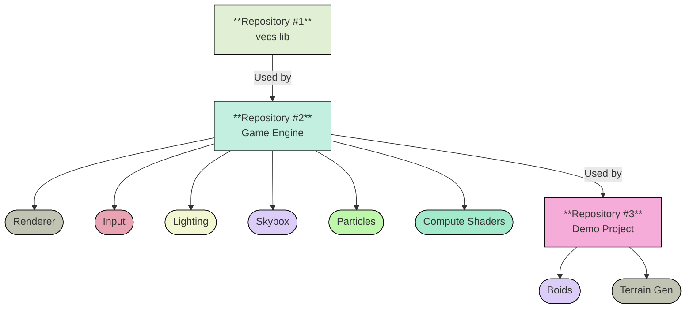

```mermaid
flowchart TD
    A0[**Repository #1**
       vecs lib]

    B0[**Repository #2**
       Game Engine]
    B1([Renderer])
    B2([Input])
    B3([Lighting])
    B4([Skybox])
    B5([Particles])
    B6([Compute Shaders])

    C0[**Repository #3** 
       Demo Project]
    C1([Boids])
    C2([Terrain Gen])

    A0 -- Used by --> B0

    B0 --> B1
    B0 --> B2
    B0 --> B3
    B0 --> B4
    B0 --> B5
    B0 --> B6

    B0 -- Used by --> C0
    C0 --> C1
    C0 --> C2

    style A0 stroke:#0b0b0b,fill:#E1F0D4 
    style B0 stroke:#0b0b0b,fill:#C3EFE0 
    style C0 stroke:#0b0b0b,fill:#F6ACD8
    style B1 stroke:#0b0b0b,fill:#C2C4B3 
    style B2 stroke:#0b0b0b,fill:#E9A3B2 
    style B3 stroke:#0b0b0b,fill:#F2F7D2 
    style B4 stroke:#0b0b0b,fill:#DBCDF8 
    style B5 stroke:#0b0b0b,fill:#BEF6AC 
    style B6 stroke:#0b0b0b,fill:#A3E9CC 
    style C1 stroke:#0b0b0b,fill:#DBCDF8 
    style C2 stroke:#0b0b0b,fill:#C2C4B3
```
